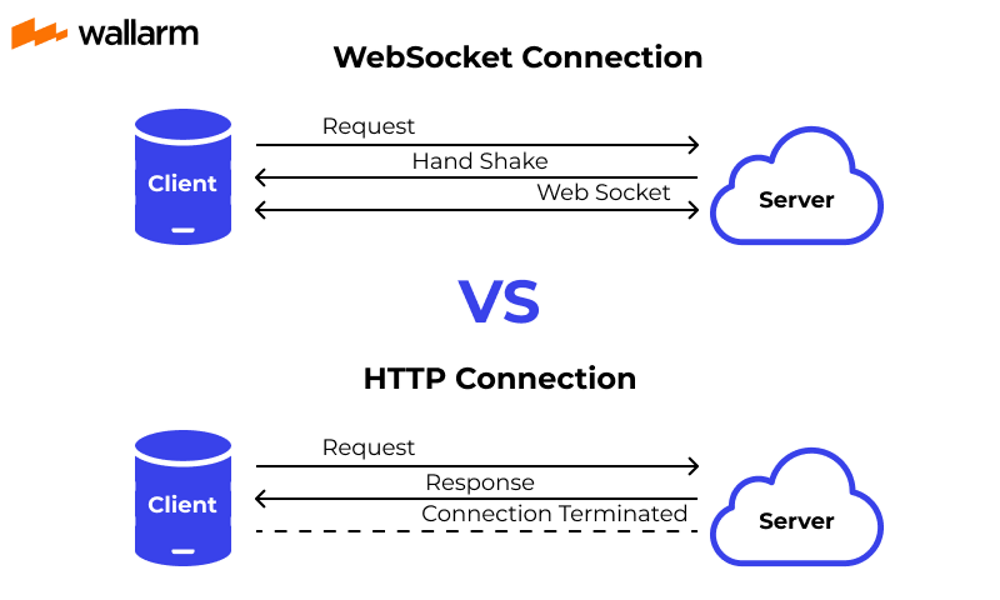
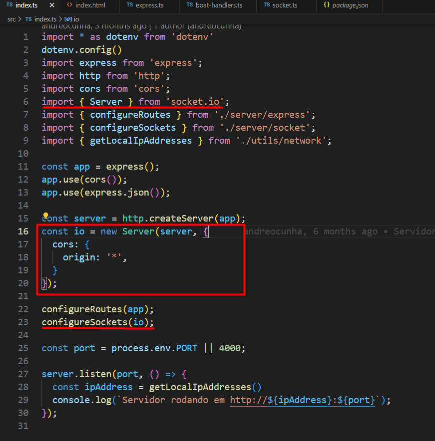
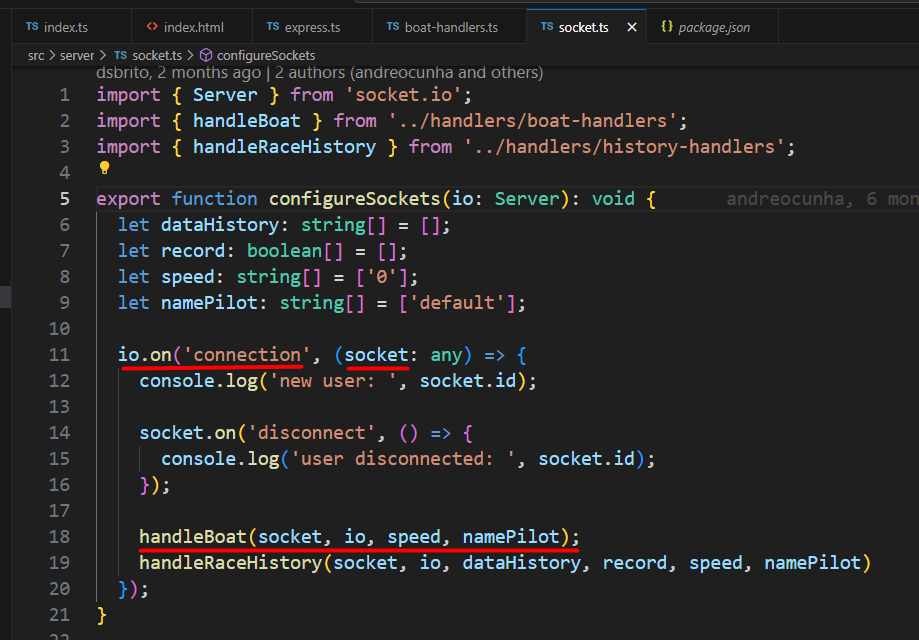
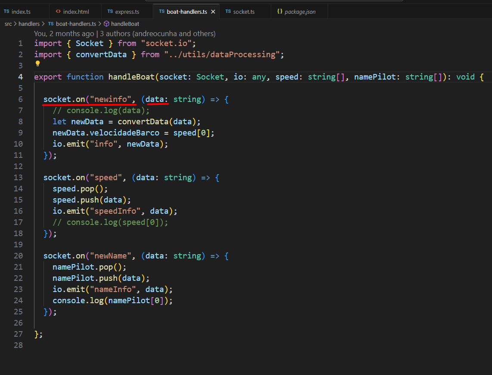
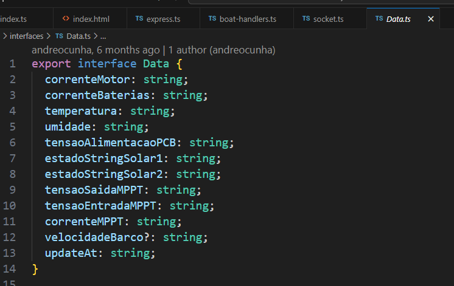

# Servidor (backend) da telemetria dos barcos

## Pré-requisitos
- Ter o Nodejs instalado na máquina [Baixar última versão LTS](https://nodejs.org/en)

## Instalação
- Clonar o repositório: `git clone https://github.com/ProjetoSolaresUfes/barcos-backend.git`
- Entrar na pasta do projeto: `cd barcos-backend`
- Instalar as dependências: `npm install`
- Iniciar o servidor: `npm run dev`
- O servidor mostrará no terminal o endereço de acesso: `http://SEU_IP:4000`
  - Ou você pode acessar o endereço `http://localhost:4000`

## Configuração do banco de dados (Firebase)
Para que as informações sejam salvas no banco de dados, é necessário criar um arquivo chamado `.env` na raiz do projeto, com o seguinte conteúdo:
```
STORAGE_BUCKET = ''
PROJECT_ID = ''
CLIENT_EMAIL = ''
PRIVATE_KEY = ''
```
- O STORAGE_BUCKET pode ser encontrado no console do Firebase, clicando na engrenagem no canto superior esquerdo, e depois em "Configurações do projeto". O valor é o nome do projeto, seguido de ".appspot.com". Ele se parece com isso: `barcos-ufes.appspot.com` e pode ser encontrado no "Geral" do projeto.
- Todos os outros valores podem ser encontrados no console do Firebase, clicando na engrenagem no canto superior esquerdo, e depois em "Configurações do projeto". Clicar em "Contas de serviço" e depois em "Gerar nova chave privada". O arquivo gerado será um JSON, e os valores devem ser copiados e colados no arquivo `.env` criado anteriormente.

## Rotas do servidor HTTP
- `http://localhost:4000/`: Rota principal do servidor. Retorna uma mensagem: "Servidor online" se o servidor estiver funcionando.
- `http://localhost:4000/info`: Rota que exibe em tempo real as informações recebidas do barco. É mostrado os últimos dados recebidos de cada sensor do barco em formato JSON.

## Rotas do servidor Socket.io
### Enviadas do cliente para o servidor:
- "newinfo" - Envia as informações do barco para o servidor. As informações devem ser enviadas em formato string separando os dados por vírgula. Ex.: 
```js
socket.emit("newinfo", "correnteMotor,correnteBaterias,temperatura,umidade,tensaoAlimentacaoPCB,estadoStringSolar1,estadoStringSolar2,tensaoSaidaMPPT,tensaoEntradaMPPT,correnteMPPT");
```
- "record" - Envia um comando para o servidor iniciar e/ou parar a gravação dos dados recebidos. Ex.: 
```js
socket.emit("record");
```

### Enviadas do servidor para o cliente:
- "info" - Envia as informações tratadas do barco para o cliente. As informações são enviadas em formato JSON. Ex.: 
```js
const newData = {
  correnteMotor: 0,
  correnteBaterias: 0,
  temperatura: 0,
  umidade: 0,
  tensaoAlimentacaoPCB: 0,
  estadoStringSolar1: 0,
  estadoStringSolar2: 0,
  tensaoSaidaMPPT: 0,
  tensaoEntradaMPPT: 0,
  correnteMPPT: 0,
  updateAt: "00/00/0000 00:00:00"
}
io.emit("info", newData);
```

# DOCUMENTAÇÃO

## TECNOLOGIAS

### NODE.JS

O Node.JS é, de forma simplificada, um programa usado para rodar código javascript no servidor(antigamente só era possível rodar javascript no navegador), possibilitando a criação de API's em Javascript.
https://nodejs.dev/en/learn/

### EXPRESS

O Node.JS é utilizado em conjunto com o Express para a criação de aplicação WEB. O Express é um framework(conjunto de bibliotecas) que fornecem métodos para a criação dos endpoints, middlewares, roteamento, e todos os elementos que compoem uma API.
https://expressjs.com/pt-br/guide/routing.html

### SOCKET.IO

Uma das principais bibliotecas usadas na aplicação é chamada socket.io(colocar link). Ela é uma biblioteca que permite uma comunicação entre sistemas com as seguintes características muito interessantes:
- Baixa latência: baixo tempo de resposta;
- Bidirecional: tanto o cliente quanto o servidor podem enviar e receber dados;
- Baseada em eventos: dados são atualizados assim que um evento determinado ocorre, como por exemplo a detecção de um novo valor de corrente no sensor emite um evento que é ouvido pelo cliente para a exibição do dado no frontend.
Por trás dos panos o socketio usa um protocolo de comunicação chamado websocket para transmitir e receber dados. Para entender como ele funciona vamos compará-lo com outro protocolo de comunicação que você com certeza já ouviu falar: o protocolo http.

O protocolo http é um protocolo de comunicação baseado em solicitação e resposta. Ou seja, um cliente(geralmente o navegador) faz uma requisição a um servidor socilitando um dado, por exemplo, e o servidor responde a essa solicitação. Já no websocket, existe uma comunicação persistente entre o cliente e servidor de modo que é possível enviar mensagens um para o outro a qualquer momento, sem a necessidade de uma nova solicitação. 

Por isso, o websocket é adequado para aplicações em tempo real, como chat ao vivo, jogos online ou, como no nosso caso, a leitura em tempo real dos dados do barco. 

Abaixo uma figura comparando o websocket com o http.


https://socket.io/docs/v4/tutorial/introduction

Para usar o socket.io precisar de um servidor e um cliente. No código abaixo o servidor é representado pela variável "io"


Na função "configureSockets", nós adicionamos uma função executada no momento em que o cliente se conecta ao servidor, descrito pelo evento 'connection'. Essa função recebe como parâmetro um objeto chamado "socket", é nele que vamos definir os eventos a serem ouvidos e emitidos pelo nosso backend e frontend. Faremos isso dentro do corpo dessa função, onde chamamos a função "handleBoat".



Dentro da "handleBoat" usamos o objeto "socket" pra lidar com eventos da seguinte forma:
A função "socket.on" recebe dois argumetos. O primeiro é o nome do evento, e o segundo é o uma função que será executada quando o evento for emitido pelo cliente. Essa função recebe como parâmetro o dado recebido pela emissão do evento, representado pela variável "data".


### TYPESCRIPT:

É uma extensão da linguagem Javascript que adiciona tipos estáticos à linguagem. Isso é importante para um código mais seguro de erros de run-time, além de possibiltar sugestões mais precisas de autocomplete do editor de texto. Por exemplo, se definirmos um tipo Pessoa com as propriedades "nome" e  "idade" e criarmos um objeto pessoa1 do tipo Pessoa, ao tentarmos escrever pessoa1.altura, por exemplo, um erro será exibido imediatamente indicando que a propriedade "altura" não existe no tipo Pessoa. Sem o Typescript, só notaríamos o problema ao rodar o projeto.

https://www.typescriptlang.org/docs/handbook/typescript-from-scratch.html

Exemplo: tipo Data definido para os dados que recebemos do ESP:


## ESTRUTURA DO PROJETO:

- Arquivo principal: index.ts
Cria o servidor onde a aplicação irá rodar, configura as rotas usadas para acessar a API (via http) e as rotas do socketio (acessados via websocket).

- Arquivo package.json: declara as bibliotecas usadas no projeto, bem como suas respectivas versões.

- Pasta views:
Contém o arquivo index.html que é exibido ao acessar a rota "/info" e mostra em um json os últimos dados recebidos ESP.

- Pasta server:
Contém as funções executadas no "index.ts" utilizadas para configurar as rotas HTTP  e a conexão do socketio.

- Pasta handlers:
Cotém as funções que definem as rotas do sockeio e o código para processar esses dados.

- Pasta interfaces:
Contém o tipo Data definido para representar os dados do ESP em um objeto.

- Pasta utils:
Contém funções auxiliares úteis que podem ser compartilhadas em outros arquivos.
Nessa pasta está, por exemplo, a função que converte o dado recebido do ESP no objeto tipo Data e a função para salvar no firebase os dados do histórico.
